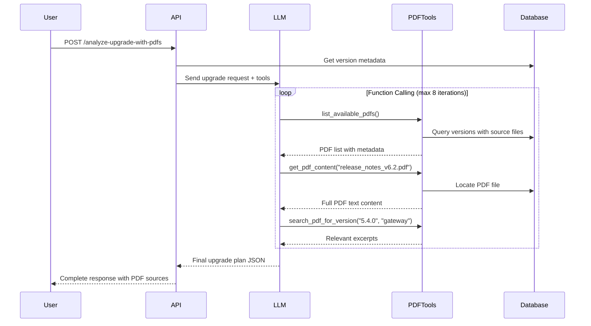

# PDF-Enhanced Upgrade Analysis

## Overview

The system now includes **function calling** capabilities that allow the LLM to autonomously retrieve PDF content during upgrade analysis. This provides more accurate and contextualized upgrade plans.

## New Endpoints

### 1. List Available PDFs
```http
GET /list-pdfs?component_type=all
```

Returns all PDFs with metadata including:
- Filename and path
- Component types (gateway/edge/orchestrator)
- Versions covered
- Document dates
- File size

**Example Response:**
```json
{
  "pdfs": [
    {
      "filename": "release_notes_v6.2.pdf",
      "relative_path": "vendor_a/release_notes_v6.2.pdf",
      "component_types": ["gateway", "edge"],
      "versions_count": 12,
      "sample_versions": ["6.2.0", "6.2.1", "6.2.2"],
      "document_dates": ["2025-01-15"],
      "file_size_kb": 1024.5
    }
  ],
  "total": 15,
  "filter": "all"
}
```

### 2. Upgrade Analysis WITH PDF Context (Function Calling)
```http
POST /analyze-upgrade-with-pdfs
```

**Request Body:**
```json
{
  "versions": [
    {
      "component": "gateway",
      "current_version": "5.4.0",
      "target_version": "6.2.0"
    },
    {
      "component": "edge",
      "current_version": "4.5.0",
      "target_version": "6.4.0"
    },
    {
      "component": "orchestrator",
      "current_version": "5.2.0",
      "target_version": "5.5.0"
    }
  ]
}
```

**What Happens:**
1. LLM receives the upgrade request with context
2. LLM **autonomously decides** which PDFs to retrieve
3. LLM calls tools to:
   - List available PDFs
   - Retrieve specific PDF content
   - Search for version-specific information
4. LLM generates upgrade plan based on **actual PDF content**

**Example Response:**
```json
{
  "status": "success",
  "result": {
    "reasoning": "After consulting release_notes_v6.2.pdf and edge_lifecycle.pdf, I determined the upgrade path requires...",
    "pdf_sources_used": [
      {
        "filename": "release_notes_v6.2.pdf",
        "relevance": "Contains detailed upgrade instructions for Gateway 5.4.0 to 6.2.0"
      },
      {
        "filename": "edge_lifecycle.pdf",
        "relevance": "Provides Edge version compatibility matrix"
      }
    ],
    "risks": [
      {
        "severity": "high",
        "description": "Edge 4.5.0 requires intermediate upgrade to 5.0.0 (per page 12 of edge_lifecycle.pdf)",
        "mitigation": "Plan for two-stage Edge upgrade"
      }
    ],
    "steps": [
      {
        "step_number": 1,
        "component": "orchestrator",
        "action": "upgrade",
        "from_version": "5.2.0",
        "to_version": "5.5.0",
        "duration_minutes": 45,
        "prerequisites": [
          "ESXi 6.7 U3 minimum",
          "Database backup completed",
          "Verify disk space >20GB"
        ],
        "instructions": [
          "Download upgrade package from VMware portal",
          "Upload to Orchestrator web UI",
          "Follow upgrade wizard (detailed in release_notes_v5.5.pdf, pages 8-12)"
        ],
        "validation": [
          "Verify Orchestrator web UI accessible",
          "Check all services running",
          "Validate database migration completed"
        ],
        "rollback": [
          "Restore from snapshot",
          "Revert database from backup"
        ],
        "pdf_references": ["release_notes_v5.5.pdf"]
      }
    ],
    "total_duration_minutes": 240,
    "recommended_maintenance_window": "Sunday 02:00-06:00 AM",
    "critical_notes": [
      "Gateway 6.2.0 requires Orchestrator 5.5.0 minimum (source: compatibility_matrix.pdf)",
      "Hardware appliances older than Edge 5xx series are EOL and require replacement"
    ],
    "tool_calls_made": [
      {
        "iteration": 1,
        "tool": "list_available_pdfs",
        "arguments": {"component_type": "all"}
      },
      {
        "iteration": 2,
        "tool": "get_pdf_content",
        "arguments": {"pdf_filename": "release_notes_v6.2.pdf"}
      },
      {
        "iteration": 3,
        "tool": "search_pdf_for_version",
        "arguments": {
          "version_number": "4.5.0",
          "component_type": "edge",
          "search_terms": ["upgrade", "compatibility"]
        }
      }
    ],
    "iterations": 3
  },
  "method": "function_calling_with_pdfs",
  "timestamp": "2026-02-07T00:55:00.000Z"
}
```

## Function Calling Tools

The LLM has access to 3 tools:

### 1. `list_available_pdfs`
Lists all PDFs with metadata filtered by component type.

### 2. `get_pdf_content`
Retrieves full text content of a specific PDF.
- Can request specific page ranges
- Returns formatted text with page markers

### 3. `search_pdf_for_version`
Searches for specific version numbers across all PDFs.
- Returns relevant excerpts with context
- Highlights matching search terms

## Advantages Over Standard Analysis

| Feature | Standard `/analyze-upgrade-path` | Enhanced `/analyze-upgrade-with-pdfs` |
|---------|----------------------------------|--------------------------------------|
| **Data Source** | Database only | Database + PDF content |
| **Context** | Metadata (versions, dates) | Full release notes text |
| **Accuracy** | General guidance | Specific instructions from PDFs |
| **Prerequisites** | Basic | Detailed from documentation |
| **References** | None | Cites source PDFs |
| **LLM Decision** | Fixed context | Autonomous PDF selection |

## Configuration

### Supported LLM Providers with Function Calling

✅ **OpenAI** (GPT-4, GPT-4 Turbo, GPT-3.5-Turbo)
- Native function calling support
- Recommended: `gpt-4o` or `gpt-4-turbo-preview`

✅ **Groq** (Llama 3.1, Llama 3.3)
- Native tool calling support
- Fast inference
- Recommended: `llama-3.3-70b-versatile`

⚠️ **Grok** (xAI)
- Function calling support (fallback to reasoning mode)

⚠️ **Gemini** (Google)
- Function calling support (fallback to reasoning mode)

### Environment Variables
```bash
# Use OpenAI or Groq for best function calling experience
LLM_PROVIDER=openai  # or groq
OPENAI_API_KEY=your_key
OPENAI_MODEL=gpt-4o

# Alternative: Groq (faster)
LLM_PROVIDER=groq
GROQ_API_KEY=your_key
GROQ_MODEL=llama-3.3-70b-versatile
```

## Example Usage

### Python
```python
import requests

response = requests.post(
    "http://localhost:8000/analyze-upgrade-with-pdfs",
    json={
        "versions": [
            {"component": "gateway", "current_version": "5.4.0", "target_version": "6.2.0"},
            {"component": "edge", "current_version": "4.5.0", "target_version": "6.4.0"}
        ]
    }
)

result = response.json()
print(f"PDFs consulted: {len(result['result']['pdf_sources_used'])}")
print(f"Tool calls made: {len(result['result']['tool_calls_made'])}")
print(f"Upgrade steps: {len(result['result']['steps'])}")
```

### cURL
```bash
curl -X POST "http://localhost:8000/analyze-upgrade-with-pdfs" \
  -H "Content-Type: application/json" \
  -d '{
    "versions": [
      {"component": "gateway", "current_version": "5.4.0", "target_version": "6.2.0"}
    ]
  }'
```

## How It Works



## Best Practices

1. **Use for Complex Upgrades**: When multiple version jumps or components are involved
2. **Check PDF References**: Validate the LLM cited relevant PDFs
3. **Review Tool Calls**: Inspect which tools were called to understand the analysis
4. **Compare Methods**: Try both endpoints and compare results
5. **Provide Feedback**: If analysis is incorrect, check if the right PDFs were consulted

## Limitations

- Maximum 8 tool calling iterations per request
- PDF content limited to text extraction (no images/charts)
- Large PDFs may be truncated for context window limits
- Function calling adds latency (typically 10-30s vs 5-10s for standard)

## Troubleshooting

**LLM doesn't call any tools:**
- Ensure you're using OpenAI or Groq provider
- Check that PDFs exist in `/app/assets`
- Verify versions in request match PDF content

**"Max iterations reached":**
- LLM couldn't complete analysis in 8 tool calls
- Try with fewer versions or simpler upgrade paths
- Check logs for which tools were called

**Empty PDF content:**
- PDF may be image-based (scanned document)
- Try different PDF extraction tool (pdfplumber vs pypdf)
- Verify PDF is not corrupted

## Future Enhancements

- [ ] Support for diagram extraction from PDFs
- [ ] Caching of PDF content for faster subsequent requests
- [ ] Parallel PDF processing
- [ ] Vector similarity search within PDFs
- [ ] Multi-language PDF support
